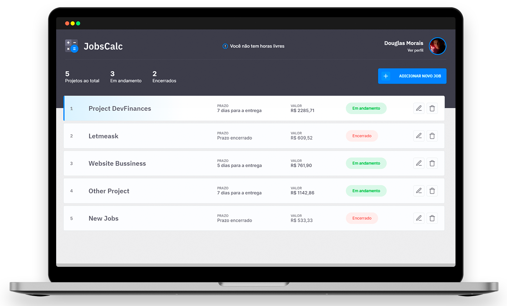

&NewLine;

  

Created for Freelancer Devs to manage their Jobs. 👩‍💻

<h4 align="center"> 
	🚧  Projeto em melhoria . . .  🚧
</h4>

 <a href="#-sobre-o-projeto">Sobre</a> •
 <a href="#-layout">Layout</a> • 
 <a href="#-funcionalidades">Funcionalidades</a> •
 <a href="#-tecnologias">Tecnologias</a> • 
 <a href="#-autor">Autor</a> • 

 <a href="#-licença">Licença</a>

## 💻 Sobre o projeto

👩‍💻 JobsCalc - é uma ferramenta criada para gerenciar os projetos de um desenvolvedor freelancer. Com ela você poderá, além de acompanhar a deadline dos projetos, calcular o valor a ser cobrado por cada job de acordo com a sua pretenção salarial.

Projeto desenvolvido durante a segunda edição da maratona **DISCOVER** oferecida pela [Rocketseat](https://app.rocketseat.com.br/discover).
O Discover é um treinamento inicial online com conteúdos básicos de desenvolvimento, mas com conhecimentos essenciais para um bom programador.

## 🎨 Layout

O layout da aplicação está disponível no Figma:

	

    

## ⚙ Funcionalidades

- [x] Adicionar nova entrada/saída 
- [x] Remover item do histórico
- [ ] Modificar item cadastrado
- [ ] Criar conexão com banco de dados
- [ ] Criar perfil de usuário
- [ ] Autenticação do usuário

## 🚀 Tecnologias

As seguintes ferramentas foram usadas na construção do projeto:

- **[Node.js](https://nodejs.org/)**
- **[Express](https://www.npmjs.com/package/express)**
- **[EJS](https://ejs.co/)**
- **[SQLITE](https://www.sqlite.org/index.html)**

> Veja o arquivo [package.json](package.json)

## 🦸 Autor

Oi, me chamo **Douglas Morais**. Entre em contato comigo! 👇 

	<a href="https://linkedin.com/in/douglasmorais" target="blank"> @douglasmorais</a>

	<a href="https://www.instagram.com/douglas_moraiis/" target="blank"> @douglas_moraiis</a>

	<a href="https://twitter.com/JDouglas_Morais" target="blank"> @JDouglas_Morais</a>

## 📝 Licença

Este projeto esta sobe a licença MIT.  
Veja o arquivo [LICENSE](.github/LICENSE) para mais detalhes.

Feito com 💙 por <a href="https://www.linkedin.com/in/douglasmorais">Douglas Morais</a>.
 
